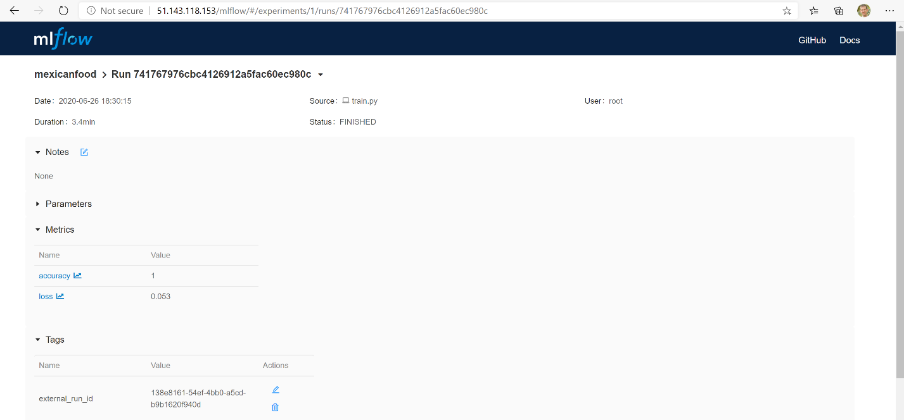

# CI/Training

In the kaizentm/kubemlops repository, when a pull request is completed and merged to master, the CI pipeline is triggered, and all jobs are run.

## Trigger CI/Training Pipeline

Merge an approved pull request to master

## Access CI pipeline via GitHub

Clicking on “Actions” tab at the top, “CI” on the left side, your pull request, and the job, you will get details on failed, finished, and skipped steps.

## Access KFP via Kubeflow Central Dashboard

1. Go to http://51.143.118.153/_/pipeline/
2. Clicking on the pipeline with the matching RUN_ID, you will get details on failed and finished steps.
and the job, you will get details on failed, finished, and skipped steps.

 
 ## Access registered model in MLFlow

1. Go to http://51.143.118.153/_/pipeline/#/runs
2. Clicking the Run name with the Pipeline Version that contains the matching RUN_ID, “register-to-aml”, and “Logs”, you will get execution logs for pipeline steps, which shows the run_id.
3. Go to http://51.143.118.153/mlflow/#/models/tacosandburritos
4. Clicking on the model version registered at the closest time to the execution of the KFP, you will get details about the Source Run.
5. Clicking on the Source Run, you will get the external_run_id, which should match the run_id in the register_to_aml pipeline step log. If it does not, try the next registered version of the model. We will add a link between the KFP and registered model at a future date.
